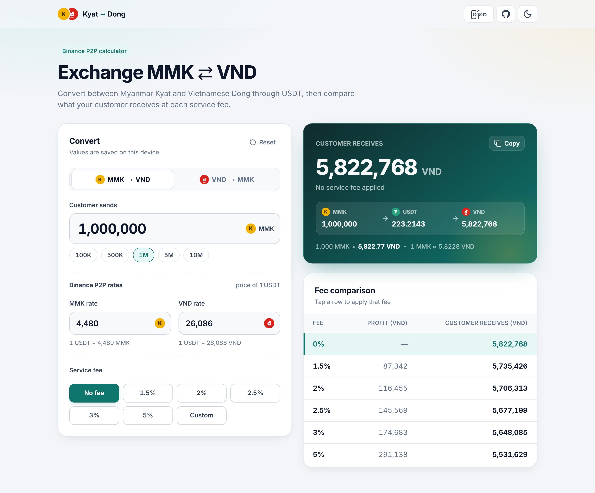

# MMK → VND Exchange

A fast, mobile-friendly calculator that converts **Myanmar Kyat (MMK)** to **Vietnamese Dong (VND)** through **USDT**, using the Binance P2P rates you enter, and shows how much the customer receives at each service-fee tier.

<p>
  <a href="https://htetnaing-hub.github.io/mmk-vnd-exchange/"></a>
  <a href="https://github.com/htetnaing-hub/mmk-vnd-exchange/actions/workflows/deploy.yml"></a>
  <a href="LICENSE"></a>
</p>

<picture>
  <source media="(prefers-color-scheme: dark)" srcset="docs/screenshot-dark.png">
  
</picture>

## How it works

You enter three values. Both rates are the price of **1 USDT**.

| Input | Example |
| --- | --- |
| Amount the customer sends | 1,000,000 |
| Binance MMK rate (1 USDT = ? MMK) | 4,480 |
| Binance VND rate (1 USDT = ? VND) | 26,086 |

The money goes through USDT, and your service fee is taken from the currency the customer receives.

**MMK → VND** (customer sends MMK, receives VND)

```
USDT              = MMK ÷ MMK rate
VND               = USDT × VND rate
Profit            = VND × fee% ÷ 100
Customer receives = VND − Profit
```

Example: 1,000,000 MMK → 223.2143 USDT → **5,822,768 VND**. At 2% the profit is 116,455 VND and the customer receives 5,706,313 VND.

**VND → MMK** (customer sends VND, receives MMK)

```
USDT              = VND ÷ VND rate
MMK               = USDT × MMK rate
Profit            = MMK × fee% ÷ 100
Customer receives = MMK − Profit
```

Example: 1,000,000 VND → 38.3347 USDT → **171,740 MMK**. At 2% the profit is 3,435 MMK and the customer receives 168,305 MMK.

Results are rounded to whole units. These formulas and examples match the original `MMK to VND Exchange App.xlsx` sheet, and the unit tests check every row of it.

## Install on iPhone (works offline)

1. Open the [live app](https://htetnaing-hub.github.io/mmk-vnd-exchange/) in **Safari**.
2. Tap the **Share** button, then **Add to Home Screen**, then **Add**.
3. Open it from the new **MMK ⇄ VND** icon. It runs full screen like a normal app.

After the first visit, everything (fonts included) is stored on the phone, so it works with no internet. When you push changes to GitHub, the app updates itself the next time it opens with a connection.

On Android, open it in Chrome and choose **Install app** from the menu.

## Features

- Two directions: **MMK → VND** and **VND → MMK**
- **Installable app with offline support** (PWA): home-screen icon, full screen, no internet needed
- **English and Burmese (မြန်မာ)** interface, picked from the browser's language on the first visit
- Live conversion with thousands separators as you type
- Quick amount buttons for each direction
- Fee presets (0%, 1.5%, 2%, 2.5%, 3%, 5%) plus a custom fee
- Fee comparison table; tap a row to apply that fee
- Step-by-step breakdown through USDT and the effective cross rate
- One-tap copy of the result
- Light and dark themes (follows the system setting by default)
- Inputs are remembered on the device (localStorage)
- Responsive layout with a sticky result bar on phones
- Keyboard and screen-reader friendly

## Tech stack

All open source and widely used, chosen for long-term maintenance:

- [React 19](https://react.dev) + [TypeScript](https://www.typescriptlang.org)
- [Vite](https://vite.dev) for development and builds
- [vite-plugin-pwa](https://vite-pwa-org.netlify.app) (Workbox) for offline support and the app manifest
- [Vitest](https://vitest.dev) for unit tests
- [ESLint](https://eslint.org) with `typescript-eslint`
- Plain CSS with design tokens (no UI framework to upgrade)
- GitHub Actions + GitHub Pages for free hosting

## Getting started

You need [Node.js](https://nodejs.org) 22 or newer.

```bash
npm install
npm run dev
```

Then open http://localhost:5173.

| Script | What it does |
| --- | --- |
| `npm run dev` | Start the dev server |
| `npm run build` | Type-check and build to `dist/` |
| `npm run preview` | Serve the production build locally |
| `npm test` | Run unit tests |
| `npm run lint` | Lint the code |
| `npm run generate-icons` | Rebuild app icons from `public/app-icon.svg` |

## Deploy to GitHub Pages

1. Create a new repository on GitHub, e.g. `mmk-vnd-exchange`.
2. Push this project to the `main` branch:
   ```bash
   git init
   git add .
   git commit -m "Initial commit"
   git branch -M main
   git remote add origin https://github.com/htetnaing-hub/mmk-vnd-exchange.git
   git push -u origin main
   ```
3. On GitHub, open **Settings → Pages** and set **Source** to **GitHub Actions**.
4. The workflow in `.github/workflows/deploy.yml` lints, tests, builds and deploys on every push to `main`. Your site appears at `https://htetnaing-hub.github.io/mmk-vnd-exchange/`.

The build uses relative asset paths, so it works under any repository name.

## Customising

- **GitHub link and defaults:** edit [`src/config.ts`](src/config.ts) to set your repository URL, starting values and quick amounts.
- **Fee tiers:** edit `FEE_TIERS` in [`src/lib/exchange.ts`](src/lib/exchange.ts).
- **Translations:** all interface text lives in [`src/i18n/messages.tsx`](src/i18n/messages.tsx). Edit the `my` section to adjust the Burmese wording.
- **Colours:** every colour is a CSS variable at the top of [`src/index.css`](src/index.css), for both light and dark themes.

## Project structure

```
src/
├── App.tsx                 Page layout and state
├── config.ts               Repo URL, default values, quick amounts
├── index.css               Design tokens and styles
├── components/
│   ├── NumberField.tsx     Formatted number input (keeps the caret in place)
│   ├── FeeSelector.tsx     Fee chips + custom fee
│   ├── ResultCard.tsx      Result, breakdown and copy button
│   ├── FeeTable.tsx        Fee tier comparison
│   ├── CurrencyBadge.tsx
│   └── Icons.tsx
├── hooks/
│   ├── usePersistentState.ts
│   ├── useInView.ts
│   └── useTheme.ts
├── i18n/
│   ├── messages.tsx        English and Burmese text
│   ├── context.ts          useI18n() hook
│   └── I18nProvider.tsx    Language state and detection
└── lib/
    ├── exchange.ts         Conversion logic, both directions (pure, unit-tested)
    ├── direction.ts        MMK → VND / VND → MMK helpers
    └── format.ts           Number formatting helpers
```

## Disclaimer

Rates are entered manually and may differ from live Binance P2P prices. This tool is for calculation only and is not financial advice.

## License

[MIT](LICENSE)
